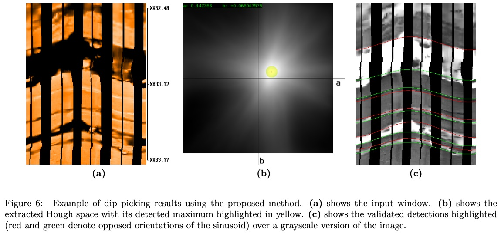

# A contrario dip picking for borehole imaging

#### 	Joris Costes, Gabriele Facciolo, Rafael Grompone von Gioi, Josselin Kherroubi, Enric Meinhardt-Llopis, and Jean-Michel Morel

We describe an algorithm to perform automatic dip picking on borehole images. One key element of the proposed method is a statistical validation, based on the a contrario theory, which is used to decide whether each candidate dip is to be accepted or not. The proposed method  also uses a randomized Hough transform, which greatly improves the processing speed,	allowing for a real-time detection of dips during image visualization. In addition, the same algorithm can be applied at different scales to provide a multi-resolution analysis of the structures. Our experiments show that the proposed algorithm produces reliable dip picking by an evaluation on three manually annotated boreholes: the proposed method detects from 60% to 90% of the dips annotated by an expert, depending on the complexity of the data.

[[article]](https://library.seg.org/doi/abs/10.1190/geo2020-0392.1) [[preprint]](https://hal.archives-ouvertes.fr/hal-03203943)  

## Data

Download and uncompress all the following files in the same folder

* [well-log A](./48-19a-c2.zip)
* [well-log B](./48-19a-c3.zip)
* [well-log C](./48-19a-c4.zip)
* [visualization of manual and automatic detections](./detections.zip)

## Online demo

COMING SOON
